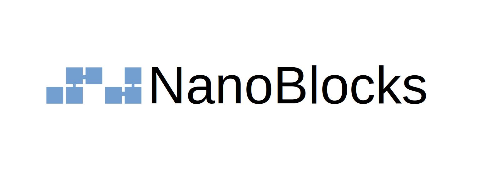

NanoBlocks
==========

`NANO <https://nano.org/>`_ is a cryptocurrency that allows instant and feeless transactions, making it a viable solution for micropayments.

`NanoBlocks` is an **unofficial** Python package built to ease the access to NANO cryptocurrency. It is intended to give an easy interface for programmers to play with the Nano Network, allowing most Nano common operations which includes creating new wallets and accounts, checking accounts information, making transactions and more.

An extensive documentation of the package can be found by `reading the docs <https://nanoblocks.readthedocs.io/en/latest/>`_.
 
Installation
------------

`NanoBlocks` can be installed through pip:

.. code-block:: bash

    pip install nanoblocks

Getting started
---------------

It is required to have a Nano node installed and configured in order to release all the functionalities that this package can give; even though it can still work offline for certain operations (like creating wallets, accounts, and building and signing blocks).

It is highly encouraged to get access to the node RPC and WebSocket servers. A guide for installation of the node can be found [here](https://docs.nano.org/running-a-node/overview/). Furthermore, a [nano-work-server](https://github.com/nanocurrency/nano-work-server) access for work generation is also recommended to enable transactions.

Everything starts with the `NanoNode` and the `NanoNetwork` classes:

.. code-block:: python

    >>> from nanoblocks.node import NanoNode
    >>> from nanoblocks.network import NanoNetwork

    >> node = NanoNode("http://localhost:7076", "ws://localhost:7078")
    >> node
    [Node http://localhost:7076 (Nano V21.2)]

    >> network = NanoNetwork(node)
    >> network
    [Node http://localhost:7076 (Nano V21.2)] (270 peers; 15362838 account)

Having a `NanoNetwork` class instance, accounts in the network can be accessed as easy as follows:

.. code-block:: python

    >>> account = network.accounts["nano_39a73oy5ungrhxy5z5oao1xso4zo7dmgpjd4u74xcrx3r1w6rtazuouw6qfi"]
    >>> account
    nano_39a73oy5ungrhxy5z5oao1xso4zo7dmgpjd4u74xcrx3r1w6rtazuouw6qfi (
        Total blocks: 733
        Total balance: 0.000002000000000000000000000002 NANO
        Confirmed balance: 0.000000000000000000000000000000 NANO
        Pending balance: 0.000002000000000000000000000002 NANO
        Last confirmed payment: 2020-12-02 01:30:39+01:00
        Is virtual: False

Blocks can be accessed as follows:

.. code-block:: python

    >>> block = network.blocks["4FEC4BDD078C741F599221C67C8BE6493C872EF9B30968BBF4991640FFF42DA2"]
    >>> block
    [Block #4 from account nano_39a73oy5ungrhxy5z5oao1xso4zo7dmgpjd4u74xcrx3r1w6rtazuouw6qfi]
        Type: receive
        Hash: 4FEC4BDD078C741F599221C67C8BE6493C872EF9B30968BBF4991640FFF42DA2
        Source account: nano_39a73oy5ungrhxy5z5oao1xso4zo7dmgpjd4u74xcrx3r1w6rtazuouw6qfi
        Amount: 0.000040000000000000000000000000
        Local date: 1970-01-01 01:00:00+01:00

And wallets can be accessed as follows:

.. code-block:: python

    # To access an existing wallet by using the 64-Bytes seed:
    >>> wallet = network.wallets["7F632A80ECCC54A058602CD64A81D23A6B4D7320562E4767C9EB0BBB1151CDF2"]

    # Alternatively, it can be accessed with the BIP-39 24 words:
    >>> wallet = network.wallets[['legal', 'bone', 'parent', 'sunset', 'shed', 'expand', 'ghost', 'airport', 'stone', 'favorite', 'innocent', 'inquiry', 'regular', 'ridge', 'life', 'shift', 'electric', 'dinner', 'kiss', 'blast', 'rain', 'pottery', 'daughter', 'execute']]

    # Wallet information can be printed out
    >>> print(wallet.seed)
    7F632A80ECCC54A058602CD64A81D23A6B4D7320562E4767C9EB0BBB1151CDF2

    >>> print(wallet.mnemonic)
    ['legal', 'bone', 'parent', 'sunset', 'shed', 'expand', 'ghost', 'airport', 'stone', 'favorite', 'innocent', 'inquiry', 'regular', 'ridge', 'life', 'shift', 'electric', 'dinner', 'kiss', 'blast', 'rain', 'pottery', 'daughter', 'execute']

Which allows to access accounts as follows:

.. code-block:: python

    >>> account_0 = wallet.accounts[0]

Easy, right? Check all what you can do by `reading the docs <https://nanoblocks.readthedocs.io/en/latest/>`_!

LICENSE
-------

This package is license under the MIT license.